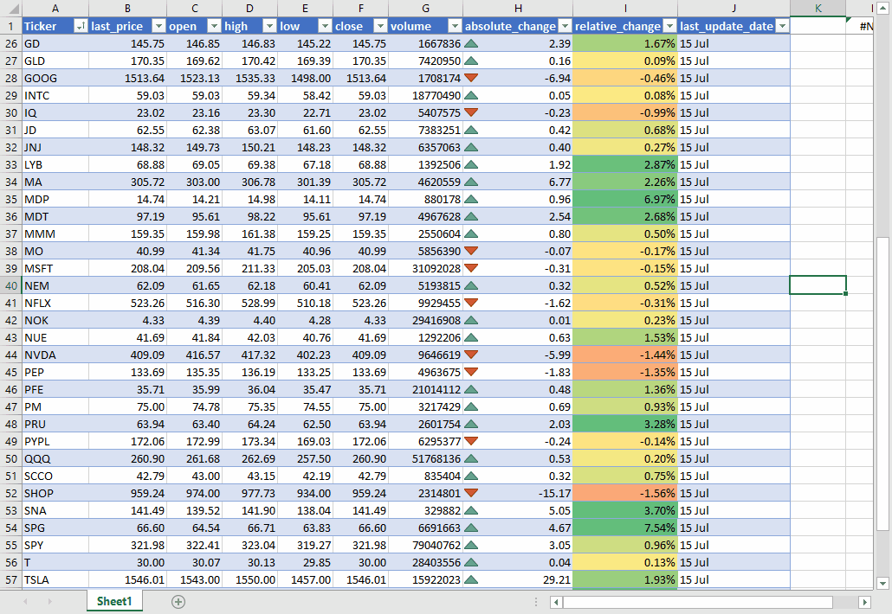

# Python Prerequisites

## Python version 3.x for Windows

* Install it from https://www.python.org/downloads/windows
* Recommend install 64 bit (x64) build

## Install [pywin32](https://github.com/mhammond/pywin32/releases)

* You should choose matching installation file with your Python version and bitness.
* For Python 3.8 64bit, use `pywin32-228.win-amd64-py3.8.exe`
* __IMPORTANT__: This folder  `<Your Python Installation Path>\Lib\site-packages\pywin32_system32` need to be added to the `PATH` environment variable.
    * Alternatively (This is what I'm doing), you can copy the two DLL files (`pythoncom38.dll` and `pywintypes38.dll`) under the `<Your Python Installation Path>\Lib\site-packages\pywin32_system32` to `<Your Python Installation Path>` assuming that is already in the `PATH` environment variable.
    * If you didn't change Python installation folder from the Python Installer, default Python installation folder would be `C:\User\<Your UserName>\AppData\Local\Programs\Python\Python38` or `%LOCALAPPDATA%\Programs\Python\Python38`.
    * If your Python application path was not added to the `PATH` environment variable at the Python installation time, you can follow instructions in [this web page](https://datatofish.com/add-python-to-windows-path/) to add Python application path to the `PATH` environment variable.

# Hot to register a Python RTD

* To install Python Excel RTD COM server:
    * Type `py <python file name> --register`
    * e.g. ``py stockrow_rtd.py --register``

# Demo

## Stockrow RTD demo

